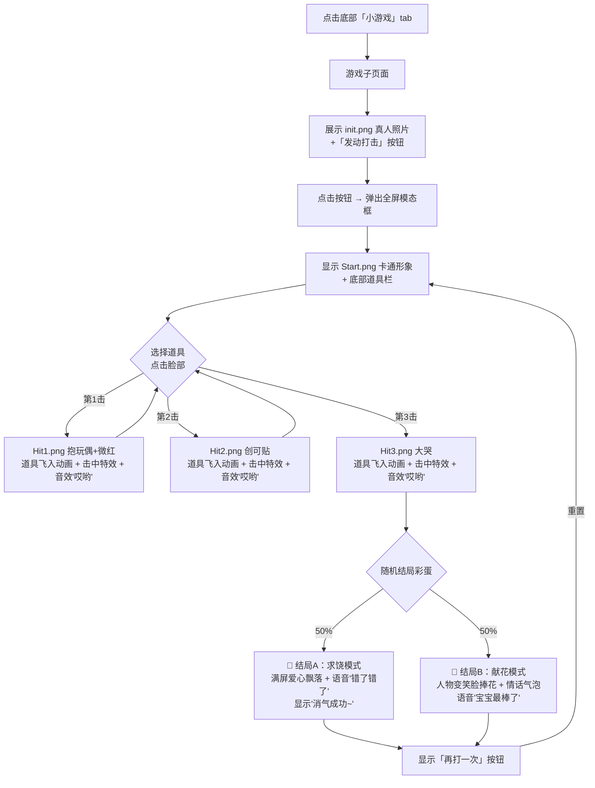

# 🎮「打脸消气」小游戏 — 完整设计文档

> 参考游戏《打人先打脸》，用AI生成受击照片/视频给女朋友消气
> 设计日期：2026-04-10

---

## 一、整体架构

```
底部tab栏「小游戏」→ 游戏子页面 → 点击「开始」→ 全屏模态框游戏
```

## 二、用户流程图



## 三、页面结构

### 3.1 游戏子页面 `#tab-game`（替换 index.html 中的占位内容）

| 区域 | 内容 |
|------|------|
| 标题区 | 手写体标题「打脸消气 😤」+ 一句话副标题 |
| 主视觉区 | `init.png` 真人恐龙装照片（吸引注意） |
| 入口按钮 | 「发动打击 🗡️」（点击后弹出模态框进入正式游戏） |

### 3.2 全屏游戏模态框 `#hitFaceModal`

| 区域 | 内容 |
|------|------|
| 角色展示区 | 中央大图区域，显示 Start→Hit1→Hit2→Hit3 图片切换 |
| 道具选择栏 | 底部固定，CSS绘制的卡通道具图标供选择 |
| 击中特效层 | 覆盖在角色图上的特效层（拖鞋印、压扁效果等） |
| 连击计数器 | 左上角显示已击打次数 |
| 结局覆盖层 | Hit3后显示彩蛋内容（隐藏直到触发） |
| 关闭/重置按钮 | 右上角 ✕ 或结束后出现「再打一次」 |

## 四、素材清单

### 4.1 角色状态图片（已有）

路径：`img/HitFace/`

| 文件名 | 状态 | 描述 |
|--------|------|------|
| `init.png` | 初始态（首页展示） | 真人恐龙装照片（张牙舞爪） |
| `Start.png` | 游戏就绪态 | AI卡通版同姿势（转换画风） |
| `Hit1.png` | 第1击后 | 抱着小恐龙玩偶，脸微红 |
| `Hit2.png` | 第2击后 | 鼻子上贴了创可贴 |
| `Hit3.png` | 第3击后（最终态） | 嚎啕大哭，泪流满面 |

### 4.2 道具清单（CSS绘制卡通图标）

| 道具 | 名称 | 击中特效描述 | CSS绘制思路 |
|------|------|-------------|------------|
| 🛏️ | 抱枕 | 脸部被压扁变形 | 圆角矩形 + 柔和阴影色 |
| 🩴 | 拖鞋 | 脸上留下拖鞋印痕 | 椭圆底 + 带子弧线 |
| 🍳 | 平底锅 | 脸部锅印 + 眼冒金星 | 圆形 + 手柄线条 |
| 🎈 | 气球 | 脸被挤压变形 | 圆形 + 下面三角绳结 |
| 🧦 | 袜子 | 脸上袜子印 + 臭气符号 | 梯形 + 波浪边缘 |
| 🥚 | 鸡蛋 | 蛋液流下效果 | 椭圆碎裂 + 黄色滴落 |

> 后续如需替换为精美图片，只需修改 CSS 为 `background-image` 即可

### 4.3 音频文件（待用户提供）

路径：`game/HitFace/music/`

| 文件名 | 用途 | 触发时机 |
|--------|------|---------|
| `hit.mp3` | 受击音效「哎哟～」 | 每次击中时播放 |
| `sorry.mp3` | 道歉音效「错了错了」 | 结局A（求饶模式）触发时 |
| `praise.mp3` | 夸奖音效「宝宝最棒了」 | 结局B（献花模式）触发时 |

## 五、状态机与数据结构

```javascript
const GAME_STATES = {
  READY:     { image: 'Start.png',   hits: 0,  desc: '来吧！放马过来！' },
  HIT_1:     { image: 'Hit1.png',    hits: 1,  desc: '哎哟！抱着小恐龙求饶中...' },
  HIT_2:     { image: 'Hit2.png',    hits: 2,  desc: '呜...贴了创可贴好痛痛...' },
  HIT_3:     { image: 'Hit3.png',    hits: 3,  desc: '哇啊啊啊哭给你看！！' },
  ENDING_A:  { image: null,          hits: 3,  desc: '消气成功~ 对不起嘛宝宝' },   // 求饶结局
  ENDING_B:  { image: null,          hits: 3,  desc: '宝宝最棒了！送你花花❀' }     // 献花结局
};
```

## 六、文件规划

| 文件 | 操作 | 用途 |
|------|------|------|
| `index.html` | 修改 | 新增游戏模态框HTML + 替换 tab-game 占位内容 |
| `css/hitface.css` | **新建** | 打脸游戏全部样式：模态框布局、道具栏、击中特效、结局动画、手机端适配 |
| `js/hitface-game.js` | **新建** | 游戏核心逻辑：HitFaceGame 类（状态管理、道具选择、击中动画、音效播放、结局触发） |
| `img/HitFace/*.png` | 已有 | init / Start / Hit1 / Hit2 / Hit3 五张角色状态图 |
| `game/HitFace/music/` | 待补充 | 音频文件（由用户提供后接入） |

## 七、交互细节

### 7.1 核心交互流程

1. **选道具 → 点脸部**：选中道具有高亮态，点击角色图任意位置触发打击
2. **道具飞入动画**：从点击坐标飞向脸部中心（CSS transform + transition 或 JS 计算轨迹）
3. **击中瞬间效果序列**：
   - 角色图 `scale(0.95)→scale(1)` 回弹（被打缩一下）
   - 屏幕微震动 `translateX(±3px)`
   - 特效层显示对应道具的印记（如拖鞋印贴在脸上）
   - 播放 `hit.mp3`
4. **图片切换**：击中后延迟 ~300ms 切换到下一张状态图（带 fade 过渡）
5. **连击保护**：动画播放期间禁止重复点击（防狂点跳状态）

### 7.2 结局彩蛋逻辑

- **结局A（50%概率）— 求饶模式**：
  - 人物保持 Hit3 哭脸或变为跪地姿势
  - 满屏爱心/花朵飘落动画（CSS particle）
  - 播放 `sorry.mp3`（「错了错了」）
  - 显示文字气泡：「消气成功~ 对不起嘛宝宝 💕」

- **结局B（50%概率）— 献花模式**：
  - 人物变为笑脸（或用特殊图片）+ 捧花束动画
  - 情话气泡随机显示一句甜蜜文案
  - 播放 `praise.mp3`（「宝宝最棒了」）

- **共同行为**：两种结局都显示「再打一次 🔁」按钮，点击后重置回 READY 状态

## 八、手机端适配要点

| 项目 | 适配策略 |
|------|----------|
| 角色图尺寸 | 最大宽度90vw，高度自适应 |
| 道具栏 | 底部固定，横向排列，每个道具触摸区 ≥44px |
| 击中区域 | 整张图都可点击（扩大触控面积） |
| 模态框 | 全屏铺满，去掉多余padding |
| 动画性能 | 优先使用 transform/opacity，避免 layout thrashing |

---

## 九、设计决策记录

| 决策项 | 选择 | 原因/备注 |
|--------|------|-----------|
| 入口方式 | 放在小游戏tab子页面内 | 复用现有tab架构，不破坏首页布局 |
| 道具选择 | 用户手动自选 | 体验更有参与感，底部道具栏选武器 |
| 游戏结束 | Hit3后随机彩蛋再重置 | 增加惊喜感，两种结局（求饶/献花） |
| 击中视觉效果 | 道具飞入 + 击中特效 | 不做屏幕震动和连击计数（用户未选中） |
| 道具图标实现 | CSS绘制卡通道具 | 先用CSS实现，后续可替换为精美图片 |
| 音效方案 | 用户提供mp3文件 | 路径约定为 `game/HitFace/music/` |

---

*本文档用于后续 AI agent 开发参考，所有设计决策已与需求方确认。*
